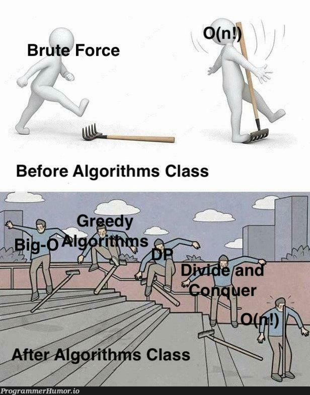

# Graph Theory and Computational Complexity

<!-- markdownlint-disable MD033 -->

  

<!-- markdownlint-enable MD033 -->

## Contents

1. Why study Graph Theory and Computational Complexity?;
1. Graphs, Paths, and Cycles;
1. Trees;
1. Computational Complexity;
1. Algorithm Analysis;
1. Search and Sorting Algorithms;
1. Recursion;
1. Greedy Algorithms; and
1. P, NP-Complete, and NP-Hard Problems.

## Dependencies

- C/C++ Compiler; and
- [`typst`](https://typst.app) for the slides.

The slides are generated using [Typst](https://typst.app) with GitHub Actions
and can be found in the
[`latest version`](https://github.com/storopoli/grafos-complexidade/releases/latest/download/slides.pdf).

For the Portuguese version, check out the [README-pt.md](README-pt.md).
Para a versão em português, confira o [README-pt.md](README-pt.md).

## License

This content is licensed under a
[Creative Commons Public Domain CC0 1.0 License](https://creativecommons.org/publicdomain/zero/1.0/).

